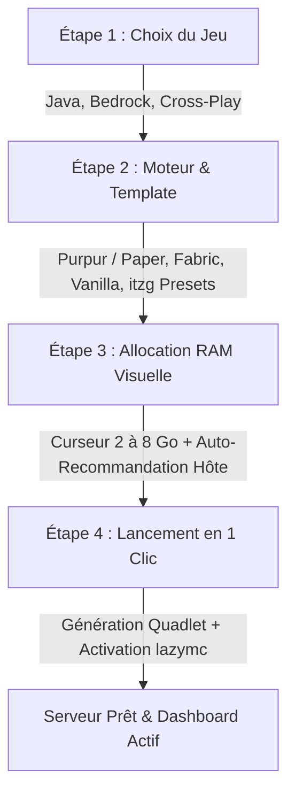

# Spécification UX Onboarding Débutant (Zero-Code / 1-Click Setup) & Mode Dual ChiPanel

Ce document constitue la **spécification d'architecture UX, fonctionnelle et technique** du système d'onboarding débutant ("Zero-Code / 1-Click") et de la navigation bimodale ("Novice / 1-Click" vs "Power User / Expert") pour **ChiPanel**, ainsi que sa compatibilité avec une exécution Desktop (Tauri / Localhost).

---

## 1. Philosophie & Paradigme Dual-Mode

### 1.1 Le Paradoxe du Homelab & Serveur Minecraft
Les panneaux de gestion de serveurs Minecraft souffrent historiquement d'une dichotomie néfaste :
- **Les panneaux grand public (ex: Aternos)** : Sur-simplifiés, bridés, saturés de publicités, sans accès aux fichiers bas niveau, conteneurs ou performances réelles.
- **Les panneaux techniques (ex: Pterodactyl, Portainer)** : Complexes, réclamant la compréhension des images Docker, des montages de volumes, des ports UDP/TCP, des variables d'environnement JVM et des allocations de mémoire non-heap.

### 1.2 Le Paradigme Dual-Mode ChiPanel
ChiPanel réconcilie ces deux mondes grâce au principe de **Divulgation Progressive (Progressive Disclosure)** :
1. **Mode Novice (1-Click / Zero-Code)** :
   - Parcours guidé pas-à-pas en 4 étapes visuelles.
   - Zéro ligne de commande, zéro configuration YAML/TOML, zéro terme obscur.
   - Valeurs par défaut intelligentes : moteur ultra-optimisé (Purpur), auto-veille `lazymc` activée (0 Mo de RAM au repos), allocation RAM recommandée selon la machine hôte réelle, EULA accepté en 1 clic.
2. **Mode Power User (Expert / DevOps)** :
   - Déverrouillage instantané de l'ensemble des leviers d'ingénierie : inspection du fichier Quadlet Podman (`~/.config/containers/systemd/minecraft.container`), terminal RCON direct, arguments JVM fins (`-XX:+UseG1GC`, `-XX:G1ReservePercent=15`), cgroups Linux (CPU shares, limites mémoire oom-killer), variables d'environnement `itzg/minecraft-server`, profiler `spark` et pré-génération `chunky`.

### 1.3 Sélecteur de Mode Global & Persistance
- **Sélecteur visuel :** Présent en haut à droite du header et dans les paramètres sous forme de switch tactile hardware (`ModeSwitch.svelte`).
- **Raccourci Clavier 0ms :** `Alt+M` (ou `Option+M` sur macOS) bascule instantanément sans latence d'animation.
- **Persistance :** Stockage dans les préférences locales (`localStorage.chipanel_user_mode`) avec synchronisation réactive via Svelte 5 runes (`$state`).

```
┌────────────────────────────────────────────────────────────────────────┐
│  CHIPANEL v1.0                     [ 🟢 En ligne ]  [ ⚡ Novice | Expert ]│
├────────────────────────────────────────────────────────────────────────┤
│  Mode Novice (1-Click)             │  Mode Expert (Power User)         │
│  - 4 étapes visuelles guidées      │  - Éditeur YAML / Quadlet brut    │
│  - Moteur recommandé auto          │  - 11 moteurs & sélecteur de build│
│  - Curseur RAM avec jauge hôte     │  - Flags JVM & cgroups cpus/mem   │
│  - Veille lazymc activée par défaut│  - Terminal RCON & raw socket UDS │
│  - Zéro jargon système             │  - Registre d'audit & D-Bus status│
└────────────────────────────────────────────────────────────────────────┘
```

---

## 2. Parcours Utilisateur Débutant (Onboarding en 4 Étapes)

Le flux de premier lancement ou de création de serveur s'articule autour d'un wizard compact, lisible et tactile (`OnboardingWizard.svelte`).



---

### Étape 1 : Choix du Jeu (`GameSelectorStep.svelte`)
L'utilisateur choisit la plateforme cible via des tuiles à double biseau tactile.

| Option | Titre UI | Description Débutant | Badges Techniques Internes |
| :--- | :--- | :--- | :--- |
| **`JAVA`** (Défaut) | **Minecraft Java Edition** | Pour jouer sur PC (Windows, Mac, Linux). Supporte tous les mods et plugins populaires. | `Port 25565 TCP`, `OpenJDK 21`, `Modrinth Ready` |
| **`BEDROCK`** | **Minecraft Bedrock Edition** | Pour consoles (Xbox, PlayStation, Switch) et smartphones / tablettes (iOS, Android). | `Port 19132 UDP`, `Bedrock Dedicated Server` |
| **`CROSSPLAY`** | **Cross-Play PC & Consoles** | Permet aux joueurs Java et Bedrock de jouer ensemble sur le même monde (Geyser + Floodgate). | `Port 25565 TCP + 19132 UDP`, `Paper + Geyser` |

*Micro-interaction :* Clic avec retour physique `active:scale-[0.97]`, bordure active ambre/bleue subtile (`#3B82F6` ou `#0FA968`), coche d'état vectorielle.

---

### Étape 2 : Type de Serveur & Moteur (`EngineSelectorStep.svelte`)
Sélection du moteur sans jargon technique rébarbatif, avec explications en langage naturel.

#### 1. Les 4 Profils Débutants Majeurs
1. **Purpur / PaperMC (Recommandé - Performance Ultime)** :
   - *Explication :* "Le choix idéal pour jouer entre amis ou en communauté sans lag. Optimise le jeu et permet d'ajouter des extensions (plugins)."
   - *Avantages affichés :* 0 lag, anti-triche natif, compatible 100% des plugins Bukkit/Spigot.
2. **Fabric (Mods Modernes)** :
   - *Explication :* "Pour jouer avec des mods modernes et légers (nouveaux blocs, créatures, dimensions, shaders serveur)."
   - *Avantages affichés :* Mises à jour instantanées, très faible consommation mémoire.
3. **Vanilla (Officiel Mojang)** :
   - *Explication :* "Le jeu d'origine pur, exactement tel que conçu par Mojang. Recommandé pour tester les snapshots."
4. **Templates Prêts à l'Emploi (`itzg` Container Presets)** :
   - **Template Survie Optimisée** (Purpur + Spark + Chunky + LuckPerms pré-installés).
   - **Template Moddé Léger** (Fabric + Lithium + FerriteCore + FastSuite).
   - **Template Homelab Eco / Low-RAM** (Paper optimisé Aikar Flags pour CPU 2C/4T et 4-8 Go de RAM).

#### 2. Sélecteur de Version Intelligent
- Par défaut réglé sur **"Dernière Version Stable" (LATEST)**.
- Option dépliable pour choisir une version spécifique (ex: `1.21.4`, `1.20.1` pour les gros modpacks) via l'API Mojang Version Watcher intégrée.

---

### Étape 3 : Allocation RAM Visuelle & Conscience Matérielle (`RamAllocationStep.svelte`)

L'allocation de mémoire vive est la première source de crashs des serveurs Minecraft (OutOfMemoryError ou gel de l'OS hôte par l'OOM killer Linux). ChiPanel supprime cette friction par une détection en direct et un curseur visuel assisté.

#### 1. Détection Automatique du Matériel Hôte
Le backend ChiPanel interroge `/proc/meminfo` (ou l'API système Tauri en mode desktop) et transmet la mémoire totale de la machine hôte.

#### 2. Algorithme de Recommandation Intelligente
$$\text{RAM Recommandée} = \begin{cases} 
2\text{ Go} & \text{si RAM Hôte} \le 4\text{ Go} \\
4\text{ Go} & \text{si RAM Hôte} = 8\text{ Go} \quad (\text{ex: HP 250 G3 Haswell}) \\
6\text{ Go} & \text{si RAM Hôte} = 12\text{ Go} \\
8\text{ Go} & \text{si RAM Hôte} \ge 16\text{ Go}
\end{cases}$$

*Règle de sécurité système :* ChiPanel conserve **au minimum 2 Go de RAM** pour le système d'exploitation Linux, Podman rootless, ChiPanel et le cache de pages du disque dur.

#### 3. Jauge Visuelle de Répartition de Mémoire (Memory Breakdown Gauge)
L'utilisateur visualise en direct la segmentation de la RAM :
```
┌────────────────────────────────────────────────────────────────────────┐
│  MACHINE HÔTE : 8.0 Go DÉTECTÉS                                        │
│                                                                        │
│  [ OS & ChiPanel: 2.0 Go ] [ JVM Minecraft: 4.0 Go ] [ Libre: 2.0 Go ] │
│  ■■■■■■■■■■■■■■■■■■■■■■■■■ ■■■■■■■■■■■■■■■■■■■■■■■■■■■ ■■■■■■■■■■■■■■■ │
│                                                                        │
│  Curseur RAM : [───●────────────────]  4.0 Go (Recommandé 5-10 joueurs)│
│  [ ⚡ Appliquer la recommandation automatique (4 Go) ]                 │
└────────────────────────────────────────────────────────────────────────┘
```

#### 4. Curseurs & Seuils de Tolérance
- **Curseur fluide :** De 1 Go à 16 Go (pas de 0.5 Go).
- **Avertissement automatique :** Si l'utilisateur sélectionne plus de 75% de la RAM machine totale, une alerte ambre non-bloquante signale le risque de contention avec le système hôte.

---

### Étape 4 : Lancement en 1 Clic & Automatisation Zero-Ops (`LaunchReviewStep.svelte`)

Le dernier écran résume les choix et déclenche la création complète du serveur en un clic.

#### 1. Résumé Visuel & Options Débutant
- **Récapitulatif clair :** Moteur choisi, version, allocation RAM, ports exposés.
- **Interrupteur Veille Automatique `lazymc` (Activé par défaut) :**
  - "Économie d'énergie : Le serveur s'endort automatiquement après 10 min sans joueur (0 Mo de RAM consommée) et se réveille instantanément dès qu'un ami se connecte au port 25565."
- **Validation EULA Mojang :** Case à cocher pré-validée avec lien vers les conditions de Mojang.

#### 2. Accordéon "Aperçu Technique Power User" (Optionnel)
Un clic sur "Voir la configuration Quadlet générée" permet aux utilisateurs avancés d'inspecter le fichier `minecraft.container` généré avant l'exécution :
```ini
[Unit]
Description=Minecraft Server (Purpur 1.21.4)
After=network-online.target

[Container]
ContainerName=minecraft-server
Image=docker.io/itzg/minecraft-server:latest
Environment=TYPE=PURPUR
Environment=VERSION=1.21.4
Environment=MEMORY=4G
Environment=EULA=TRUE
Environment=USE_AIKAR_FLAGS=true
Volume=%h/minecraft/data:/data:Z
PublishPort=127.0.0.1:25566:25565
```

#### 3. Le Bouton d'Action Tactile
- **Libellé :** `Démarrer le serveur maintenant`
- **Micro-interaction :** `active:scale-[0.97]`, passage à l'état de chargement avec spinner rapide (0.6s), affichage d'un flux de progression direct (Génération Quadlet -> Rechargement systemd -> Démarrage du proxy lazymc -> Redirection Dashboard).

---

## 3. Architecture Prête pour Desktop (Tauri / Localhost)

ChiPanel est architecturé pour fonctionner indifféremment en **Panneau Web Homelab (Axum / Podman)** et en **Application Desktop Native (Tauri v2 / Localhost)**.

```
┌────────────────────────────────────────────────────────────────────────┐
│                       CHIPANEL DESKTOP (Tauri v2)                      │
│                                                                        │
│  ┌──────────────────────────────────────────────────────────────────┐  │
│  │                     FRONTEND SVELTE 5 (SPA)                      │  │
│  │  - Onboarding Wizard & Dual-Mode Navigation                      │  │
│  │  - IPC Abstraction Bridge: detectRuntime(), launchServer()        │  │
│  └──────────────────────────────────┬───────────────────────────────┘  │
│                                     │  Tauri IPC Commands / WebSockets │
│                                     ▼                                  │
│  ┌──────────────────────────────────────────────────────────────────┐  │
│  │                     TAURI RUST BACKEND ENGINE                    │  │
│  │                                                                  │  │
│  │  [Local Runtime Prober]            [Process & Container Manager] │  │
│  │  - Probe Podman socket / CLI       - Rootless Podman Quadlet /   │  │
│  │  - Probe Docker Desktop socket     - Fallback Direct JVM Spawn   │  │
│  │  - Probe Java 21 / 17 (JAVA_HOME)  - Embedded lazymc Proxy       │  │
│  │                                                                  │  │
│  │  [Tray & System Integration]       [Local Storage / SQLite]      │  │
│  │  - Native Tray Icon (Sleep/Wake)   - User config & Server data   │  │
│  │  - Desktop Notifications on wake   - Zero-Cloud Local Execution  │  │
│  └──────────────────────────────────────────────────────────────────┘  │
└────────────────────────────────────────────────────────────────────────┘
```

### 3.1 Détection Automatique des Runtimes Locaux (`DesktopRuntimeBadge.svelte`)
Au démarrage, l'application desktop sonde l'environnement hôte pour identifier les moteurs de conteneurisation ou d'exécution disponibles :

1. **Sonde Podman (Option Privilégiée Homelab & Linux)** :
   - Vérification du socket `/run/user/<UID>/podman/podman.sock` ou commande CLI `podman --version`.
   - Si présent : mode Quadlet natif rootless avec intégration `systemd`.
2. **Sonde Docker Desktop (Windows / macOS / Linux)** :
   - Vérification du socket `/var/run/docker.sock` ou named pipe Windows `//./pipe/docker_engine`.
   - Si présent : pilotage direct du conteneur via Docker Engine API.
3. **Sonde Java Native Bare-Metal (Fallback Zéro-Conteneur)** :
   - Recherche du binaire `java` dans le `PATH` et inspection de `JAVA_HOME`.
   - Détection des versions OpenJDK 21, 17, 8 (Temurin, GraalVM, Corretto).
   - Permet de lancer le serveur directement sous forme de sous-processus sans nécessiter l'installation préalable de Docker ou Podman pour les débutants absolus sur Windows/macOS.

### 3.2 Pont d'Abstraction IPC Frontend (`src/lib/api/client.js`)
Le client API Svelte 5 détecte automatiquement son environnement d'exécution :
```javascript
export const isTauri = () => typeof window !== 'undefined' && '__TAURI_INTERNALS__' in window;

export async function probeSystemEnvironment() {
  if (isTauri()) {
    const { invoke } = await import('@tauri-apps/api/core');
    return await invoke('probe_system_environment');
  }
  // Fallback Web REST API
  return await apiGet('/api/system/environment');
}
```

### 3.3 Fonctionnalités Spécifiques au Mode Desktop
- **System Tray Natif :** Icône dans la barre des tâches avec état dynamique (🟢 En ligne, 🟡 En veille lazymc, ⚪ Arrêté).
- **Notifications Natives :** Notification push de bureau lorsqu'un joueur réveille le serveur depuis `lazymc` ou si la RAM dépasse 90%.
- **Démarrage au Boot :** Option de lancement minimisé dans le tray au démarrage de l'ordinateur.

---

## 4. Matrice Comparative : Mode Novice vs Mode Power User

| Dimension | Mode Novice / 1-Click | Mode Power User / Expert |
| :--- | :--- | :--- |
| **Création de Serveur** | Wizard guidé en 4 étapes avec presets prêts à l'emploi | Formulaire Quadlet avancé, injection de variables `itzg` brutes |
| **Moteurs & Versions** | 4 choix majeurs (Purpur, Paper, Fabric, Vanilla) en version `LATEST` | 11 saveurs (Purpur, Paper, Folia, Fabric, Forge, NeoForge, Quilt, Mohist, etc.) + versions de loader spécifiques et snapshots |
| **Allocation Mémoire** | Curseur assisté (2 à 8 Go) avec jauge et bouton d'auto-recommandation | Curseur étendu, flags JVM personnalisés (`-XX:+UseG1GC`, `-Xms`, `-Xmx`, GC tuning), limites cgroups Linux |
| **Veille `lazymc`** | Activée par défaut avec délai standard de 10 min | Réglages avancés du proxy : MOTD de veille personnalisé, ports forwarding custom, timeout réglable, proxy Bungee/Velocity |
| **Gestion des Fichiers** | Masquée ou simplifiée aux dossiers essentiels (`plugins`, `world`) | Arborescence complète, éditeur CodeMirror 6 avec diff visuel Myers, gestion des permissions POSIX |
| **Console & Commandes** | Boutons d'actions rapides (`/gamemode`, `/weather`, `/kick`, `/op`) | Terminal RCON interactif complet, autocomplétion des commandes, logs bruts temps réel |
| **Addons & Plugins** | Installation 1-clic des plugins essentiels certifiés (Spark, Chunky, LuckPerms) | Navigateur Modrinth v2 complet avec filtres par loader, upload `.jar`, gestion des versions et dépendances |
| **Sauvegardes** | 1 clic pour créer un snapshot automatique | Sauvegardes différentielles zstd, streaming distant S3/MinIO, rétention programmable par cron |

---

## 5. Directives de Design Tokens & Micro-Interactions (Conformité `design.md`)

Tous les composants de l'onboarding respectent rigoureusement les directives de `chipanel/design.md` :

1. **Double-Bezel Machined Hardware :**
   - Enveloppe externe (`.onboarding-shell`) : `background-color: rgba(255, 255, 255, 0.02)`, bordure `1px solid rgba(255, 255, 255, 0.06)`, `border-radius: 16px`, `padding: 6px`.
   - Cœur interne (`.onboarding-core`) : `background-color: #161922`, `border-radius: 10px`, chanfrein zénithal `box-shadow: inset 0 1px 0 rgba(255, 255, 255, 0.08)`.
2. **Règle Anti-Slop Strict :**
   - Zéro dégradé violet néon, zéro effet d'aura exagéré, zéro emoji dans l'interface (exclusivement des icônes vectorielles `lucide-svelte` en `stroke-width: 1.75px`).
   - Copywriting sobre, factuel et orienté ingénierie homelab.
3. **Micro-Interactions Emil Kowalski :**
   - Règle physique du clic : `active:scale-[0.97]` sur les cartes de sélection, curseurs et boutons d'action.
   - Entrée des modales et étapes depuis `scale(0.95)` avec `opacity: 0` (jamais depuis `scale(0)`).
   - Transitions ultra-fluides : `var(--ease-out)` (`cubic-bezier(0.23, 1, 0.32, 1)`).
4. **Contraste WCAG AAA :**
   - Fond Dark Obsidian (`#0F1117` / `#161922`), texte primaire `#F1F3F9` (contraste > 14:1), accents sémantiques 3-rôles calibrés.
